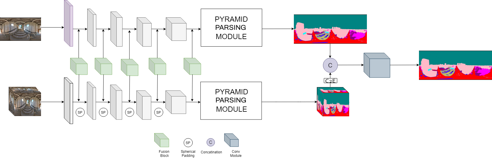

# Pyramid-Fuse

## Introduction:

This repository involves my work as a Computer Vision Intern at Virtual Viewing, UK. It combines Bifusion projection by leveraging equirectangular and cubemap projection for semantic segmentation of 360 images.


## Architecture:




## Note:
Repo under active development. Will be updated very soon - 12/08/2020


## To-Do:
```
 - [ ] Upload Results
 - [ ] Upload Pre-Trained Model
 - [ ] Comment and Clean Code
```
